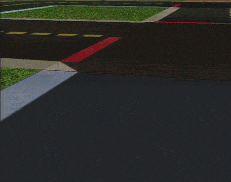

# Gym-Duckietown

[](https://circleci.com/gh/duckietown/gym-duckietown/tree/master) [](https://hub.docker.com/r/duckietown/gym-duckietown)


[Duckietown](http://duckietown.org/) self-driving car simulator environments for OpenAI Gym.

Please use this bibtex if you want to cite this repository in your publications:

```
@misc{gym_duckietown,
  author = {Chevalier-Boisvert, Maxime and Golemo, Florian and Cao, Yanjun and Mehta, Bhairav and Paull, Liam},
  title = {Duckietown Environments for OpenAI Gym},
  year = {2018},
  publisher = {GitHub},
  journal = {GitHub repository},
  howpublished = {\url{https://github.com/duckietown/gym-duckietown}},
}
```

This simulator was created as part of work done at [Mila](https://mila.quebec/).

<p align="center">
<br>
</p>

<h2 align="center">
Welcome to <b>Duckietown</b>!
</h2>

## Introduction

Gym-Duckietown is a simulator for the [Duckietown](https://duckietown.org) Universe, written in pure Python/OpenGL (Pyglet). It places your agent, a Duckiebot, inside of an instance of a Duckietown: a loop of roads with turns, intersections, obstacles, Duckie pedestrians, and other Duckiebots. It can be a pretty hectic place!

Gym-Duckietown is fast, open, and incredibly customizable. What started as a lane-following simulator has evolved into a fully-functioning autonomous driving simulator that you can use to train and test your Machine Learning, Reinforcement Learning, Imitation Learning, or even classical robotics algorithms. Gym-Duckietown offers a wide range of tasks, from simple lane-following to full city navigation with dynamic obstacles. Gym-Duckietown also ships with features, wrappers, and tools that can help you bring your algorithms to the real robot, including [domain-randomization](https://blog.openai.com/spam-detection-in-the-physical-world/), accurate camera distortion, and differential-drive physics (and most importantly, realistic waddling).

<p align="center">
<br>
</p>

There are multiple registered gym environments, each corresponding to a different [map file](https://github.com/duckietown/gym-duckietown/tree/master/gym_duckietown/maps):
- `Duckietown-straight_road-v0`
- `Duckietown-4way-v0`
- `Duckietown-udem1-v0`
- `Duckietown-small_loop-v0`
- `Duckietown-small_loop_cw-v0`
- `Duckietown-zigzag_dists-v0`
- `Duckietown-loop_obstacles-v0` (static obstacles in the road)
- `Duckietown-loop_pedestrians-v0` (moving obstacles in the road)

The `MultiMap-v0` environment is essentially a [wrapper](https://github.com/duckietown/gym-duckietown/blob/master/gym_duckietown/envs/multimap_env.py) for the simulator which
will automatically cycle through all available [map files](https://github.com/duckietown/gym-duckietown/tree/master/gym_duckietown/maps). This makes it possible to train on
a variety of different maps at the same time, with the idea that training on a variety of
different scenarios will make for a more robust policy/model.

`gym-duckietown` is an _accompanying_ simulator to real Duckiebots, which allow you to run your code on the real robot. We provide a domain randomization API, which can help you transfer your trained policies from simulation to real world. Without using a domain transfer method, your learned models will likely overfit to various aspects of the simulator, which won't transfer to the real world. When you deploy, you and your Duckiebot will be running around in circles trying to figure out what's going on.

<p align="center">
<br>
</p>

The `Duckiebot-v0` environment is meant to connect to software running on
a real Duckiebot and remotely control the robot. It is a tool to test that policies
trained in simulation can transfer to the real robot. If you want to
control your robot remotely with the `Duckiebot-v0` environment, you will need to
install the software found in the [duck-remote-iface](https://github.com/maximecb/duck-remote-iface)
repository on your Duckiebot.

<p align="center">
<br>
Duckiebot-v0
</p>

## Installation

Requirements:
- Python 3.6+
- OpenAI gym
- NumPy
- Pyglet
- PyYAML
- cloudpickle
- PyTorch

You can install all the dependencies except PyTorch with `pip3`:

```
git clone https://github.com/duckietown/gym-duckietown.git
cd gym-duckietown
pip3 install -e .
```

Reinforcement learning code forked from [this repository](https://github.com/ikostrikov/pytorch-a2c-ppo-acktr)
is included under [/pytorch_rl](/pytorch_rl). If you wish to use this code, you
should install [PyTorch](http://pytorch.org/).

### Installation Using Conda (Alternative Method)

Alternatively, you can install all the dependencies, including PyTorch, using Conda as follows. For those trying to use this package on MILA machines, this is the way to go:

```
git clone https://github.com/duckietown/gym-duckietown.git
cd gym-duckietown
conda env create -f environment.yaml
```

Please note that if you use Conda to install this package instead of pip, you will need to activate your Conda environment and add the package to your Python path before you can use it:

```
source activate gym-duckietown
export PYTHONPATH="${PYTHONPATH}:`pwd`"
```

### Docker Image

There is a pre-built Docker image available [on Docker Hub](https://hub.docker.com/r/duckietown/gym-duckietown), which also contains an installation of PyTorch.

*Note that in order to get GPU acceleration, you should install and use [nvidia-docker 2.0](https://github.com/nvidia/nvidia-docker/wiki/Installation-(version-2.0)).*

To get started, pull the `duckietown/gym-duckietown` image from Docker Hub and open a shell in the container:

```
nvidia-docker pull duckietown/gym-duckietown && \
nvidia-docker run -it duckietown/gym-duckietown bash
```

Then create a virtual display:

```
Xvfb :0 -screen 0 1024x768x24 -ac +extension GLX +render -noreset &> xvfb.log &
export DISPLAY=:0
```

Now, you are ready to start training a policy using RL:

```
python3 pytorch_rl/main.py \
        --algo a2c \
        --env-name Duckietown-loop_obstacles-v0 \
        --lr 0.0002 \
        --max-grad-norm 0.5 \
        --no-vis \
        --num-steps 20
```

If you need to do so, you can build a Docker image by running the following command from the root directory of this repository:

```
docker build . \
       --file ./docker/standalone/Dockerfile \
       --no-cache=true \
       --network=host \
       --tag <YOUR_TAG_GOES_HERE>
```

## Usage

### Testing

There is a simple UI application which allows you to control the simulation or real robot manually. The `manual.py` application will launch the Gym environment, display camera images and send actions (by external control system) back to the robot.

```
python3 manual.py --env-name Duckietown-udem1-v0
```

There is also a script to run automated tests (`run_tests.py`) and a script to gather performance metrics (`benchmark.py`).
